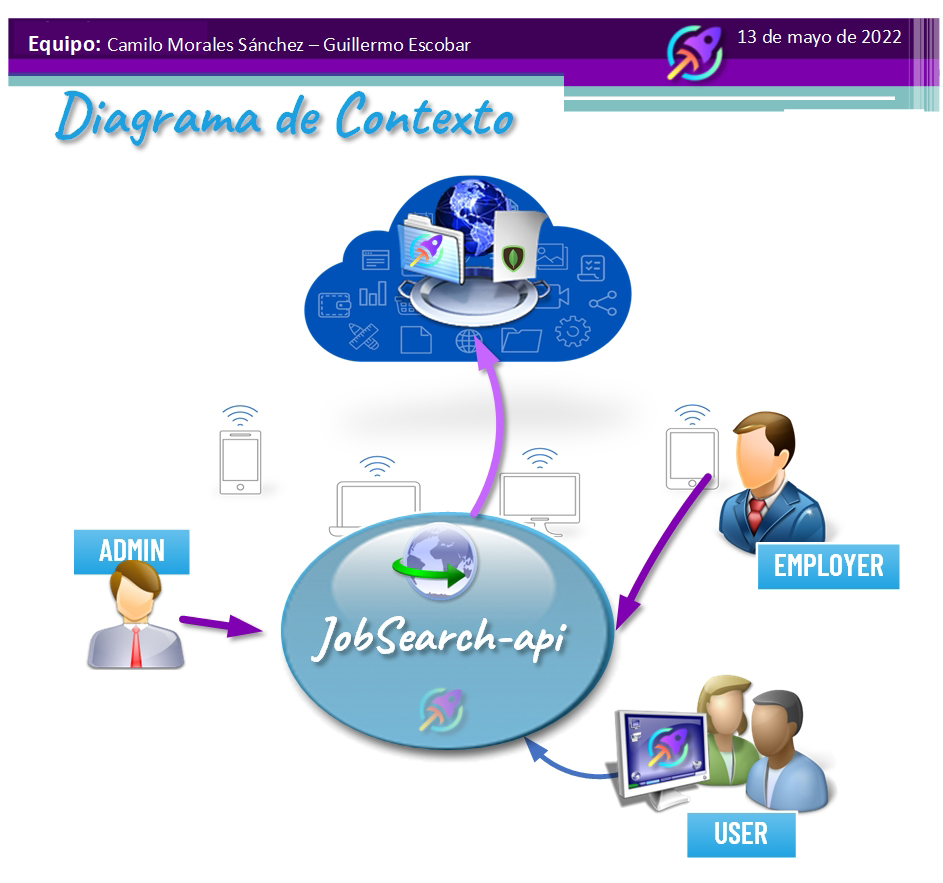

<p align='right'>
      
     
</p>

# __JobSearch API - TzuzulCode__
## SPRINT 1 de 3
<br>

## Datos del Presentación

- Fecha: `13 de mayo del 2022`
- Integrantes: `Camilo Morales Sánchez - Guillermo Escobar`

## Objetivos del Proyecto

- Construir una Api utlizando Node, express y Mongo.
- Afirmar y conectar los conceptos aprendidos en el TzuzulCode bootcamp.
- Aplicar mejores prácticas.


# __Diagrama de Contexto__ 
<br>
<p align="center">
  
</p>

## Características de Arquitectura

- Rutas desacopladas 
- Parametrización de Tablas "Countries" y "Categories"

<br>


 
__IMPORTANTE:__ Es necesario contar minimamente con la última versión estable de Node y NPM. Asegurarse de contar con ella para poder instalar correctamente las dependecias necesarias para correr el proyecto.

Actualmente las versiónes necesarias son:

 * __Node__: 12.18.3 o mayor
 * __NPM__: 6.14.16 o mayor


En la carpeta `backend` crear un archivo llamado: `.env` que tenga la siguiente forma:<br>
Ejemplo:
```
# PUERTO
PORT=8081

# STRING DE CONEION BASE DE DATOS
CONNECTION_STRING=mongodb://localhost:27017/jobSearch

# private key JWT

PRIVATE_JWT=passwordJWT
```

Reemplazar `PORT`, `CONNECTION_STRING` y `PRIVATE_JWT` con las propias credenciales.
Para más información diríjase al archivo `.env.ejemplo`


# __Especificaciones Generales__

Se trata de una API que registrará por parte las empresas empleadoras o consultoras de talent search posiciones laborales buscadas en el mercado.
Existen diferentes categorías de skill, distintas modalidades de trabajo y dichas busquedas se desarrollarán para diferentes paises
## Historia de Usuario - Épicas
<br>
<p align="center">
  
</p>

__IMPORTANTE__: Se controlará a través de un token la autorización a las siguientes funcionalidades de acuerdo a si es pertinente al tipo de usuario.

# Operaciones para el rol EMPLOYER
 
  - GENERAR ofertas laborales completando los siguientes datos:
    - Name: título de la oferta
    - Country: país donde se ofrece la posición.
    - Category: categoría a la que pertenece la oferta.
    - Detalles: Requerimientos solicitados mandatorias y/o deseables a saber:
      - Salary: Salario ofrecido.
      - Modality: Si se trata de modo presencial, remoto o híbrido.
      - Seniority: Antiguedad y experiencia requerida
      - Description: Explicación de la tarea a realizar.
  - Podrá CONSULTAR ofertas y filtrarlas según:
    - Country
    - Category
  - Puede BORRAR ofertas laborales creadas por si mismo.
  - Puede MODIFICAR ofertas laborales creadas por si mismo.

# Gestión para el rol USER
- Podrá consultar ofertas laborales y filtrarlas según:
    - Country
    - Category
 - Podrá APLICAR a ofertas laborales
 - Podrá DESAPLICAR a ofertas laborales 
 __ADVERTENCIA__: Al desaplicar a las ofertas laborales USER perderá dicha afectación, se recomienta que front end se cerciore antes de realizar el pedido a la ruta dado que no se guarda en un status de "eliminado" y no se podrá recuperar salvo que se vuelva a ejecutar todo el procedimiento de hallazgo de dicha oferta.
 

# Funcionalidades del rol ADMINISTRATOR
 
  - ADMIN puede crear, borrar, modificar y consultar USUARIOS.
  - ADMIN puede crear, borrar, modificar y consultar OARAMETROS  (las tablas COUNTRY y CATEGORY)

__IMPORTANTE__: No se desarrolla un borrado definitivo de los usuarios, se aplica una eliminación lógica a través de un campo status que podrá reestablecerse a true mediante de un UPDATE del miemo.


#### Tecnologías necesarias:

- [ ] Express
- [ ] Mongo 
- [ ] Node 


#### Base de datos - Diagrama Entidad Relación

El modelo de la base de datos se implementa en MONGODB con las siguientes tablas y referencias:

# __Diagrama Entidad Relación__  
<br>
<p align="center">
  
</p>


<br>

# __API REST__


Servidor en Node/Express con las siguientes rutas:

__URL BASE__: http://localhost:PORT/api/v1
<br>
<br>

# __Endpoints/Flags:__
<br>
<p align="left">
  
</p>

# END POINTS USERS

- [ ] __POST /user__:
  - Se le debe enviar por el body el siguiente objeto:
  ```
   Body:{
    email: {
      type: String,
      required: true,
    },
    password: {
      type: String,
      required: true,
    },
    name: {
      type: String,
      required: true,
    },
    role: {
      type: String,
      enum: ["ADMIN", "EMPLOYER", "USER"],
      default: "USER",
    },
    status: {
      type: Boolean,
      default: true,
    },
  }
  ```

- [ ] __GET /user/__:
  - Retorna todos los usuarios
  - Deberá tener rol de administrador.
  ```
  Headers:{Authorization: Bearer {{TOKEN}}}
  ```
- [ ] __PUT /user/{:id}__
  - Actualiza usuarios
  - Deberá tener rol de administrador.

  ```
  Headers:{Authorization: Bearer {{TOKEN}},}
  // Puede actualizar cualquiera de las siguientes propiedades:
  Body:{
    "email": "correo3@correo.com",
    "name": "NUEVO NOMBRE",
    "role": "ADMIN",
  }
  ```
- [ ] __DELETE /user/{:id}__:
  - Los usuarios no se eliminan, solo quedan en estado FALSE
  - Deberá tener rol de administrador.
  ```
  Headers:{Authorization: Bearer {{TOKEN}}}
  ```
- [ ] __GET /login__:
  - Retorna el TOKEN y el PAYLOAD
   ```
  Body:{
    email": "correo3@correo.com",
    "password": "A12345678*"
  }
  ```
  
# END POINTS OFFER

- [ ] __POST /offer__:
  - Deberá ser tener rol EMPLOYER
  ```
  Headers:{Authorization: Bearer {{TOKEN}}}
  Body:{
    name: {
      type: String,
      required: true,
    },
    user: {
      type: mongoId,
      required: true,
    },
    country: {
      type: mongoId,
      required: true,
    },

    category: {
      type: mongoId,
      required: true,
    },
    details: {
      salary: {
        type: Number,
        required: true,
      },
      modality: {
        type: String,
        enum: ["REMOTO", "HIBRIDO", "PRESENCIAL"],
        required: true,
      },
      seniority: {
        type: String,
        enum: ["JUNIOR", "SEMI-SENIOR", "MID-SENIOR", "SENIOR"],
      },
      description: {
        type: String,
        required: true,
      },
    },
  },
  ```

- [ ] __GET /offer/{:id}__:
  - Retorna todas las ofertas del empleador.
  ```
  Headers:{Authorization: Bearer {{TOKEN}}}
  Body:
  ```
- [ ] __GET /offer?country=""&category=""__ 

  - __IMPORTANTE__: Los parámetros son opcionales, y filtra de acuerdo al criterio de busqueda. Sea por categorí, por país, o por las dos.
  y si no se le envía parametros trae todas ofertas. No se necesita un rol específico.

  ```
  Headers:{Authorization: Bearer {{TOKEN}},}
  // Puede actualizar cualquiera de las siguientes propiedades:
  ```
- [ ] __UPDATE /offer/{:id}__:
 
  - Deberá tener rol de empleador específicamente
  - Se podrá ctualizar cualquiera de los campos.
  ```
  Headers:{Authorization: Bearer {{TOKEN}}}
  Body: {
    "name": "",
    "country": "",
    "category": "",
    "details": {
        "salary": ,
        "modality": "",
        "seniority": "",
        "description": ""
    }
   }
  ```
- [ ] __DELETE /offer/{:id}__:
  - Solamente son eliminadas por el rol empleador y no se eliminan permanentemente sino que quedanes STATUS: false
  ```
  Headers:{Authorization: Bearer {{TOKEN}}}
  ```

# END POINTS APPLICATION

- [ ] __POST /application__:
- Usuarios aplican las ofertas creadas por los empleadores.
  ```
  Headers:{Authorization: Bearer {{TOKEN}}}
  Body:   
   {
    offer: {
      type: MongoId,
      required: true,
    },
  }
  ```
- [ ] __GET /application__:
- Si es un usuario empleador trae las aplicaciones que usuarios realizaron a sus ofertas creadas.
- Si es un usuario aplicante traerá solo las ofertas aplicadas por él.
  ```
  Headers:{Authorization: Bearer {{TOKEN}}}
  Body:   
   {
    offer: {
      type: MongoId,
      required: true,
    },
  }
  ```
- [ ] __DELETE /application/{:id}__:
- El usuario dueño de la aplicación a una oferta puede desafectarse de la misma.

  ```
  Headers:{Authorization: Bearer {{TOKEN}}}
  ```
# __Requerimientos del Cliente__

<br>
<p align="center">
  
</p>


  